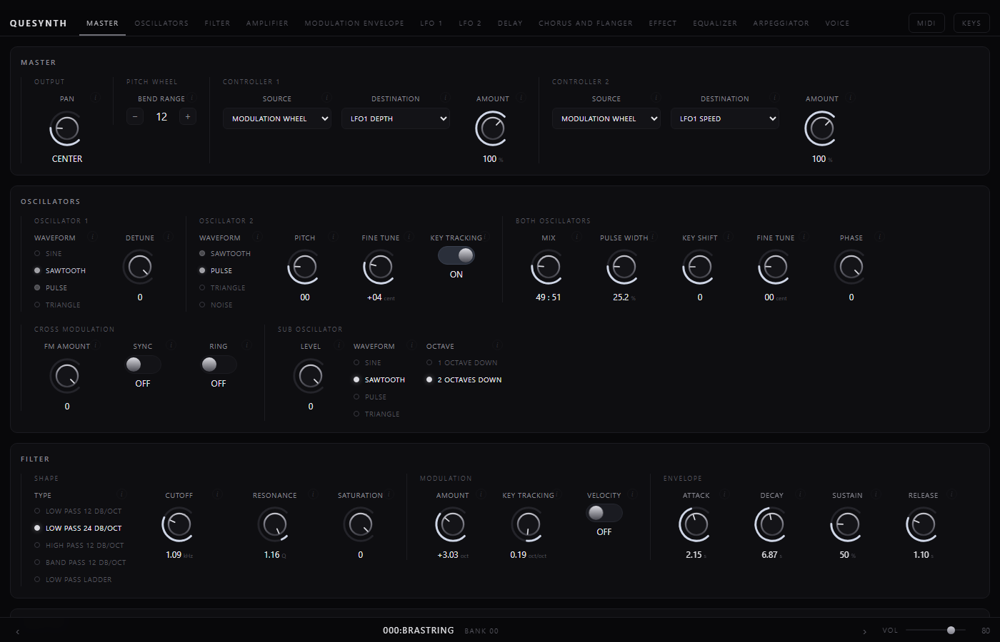
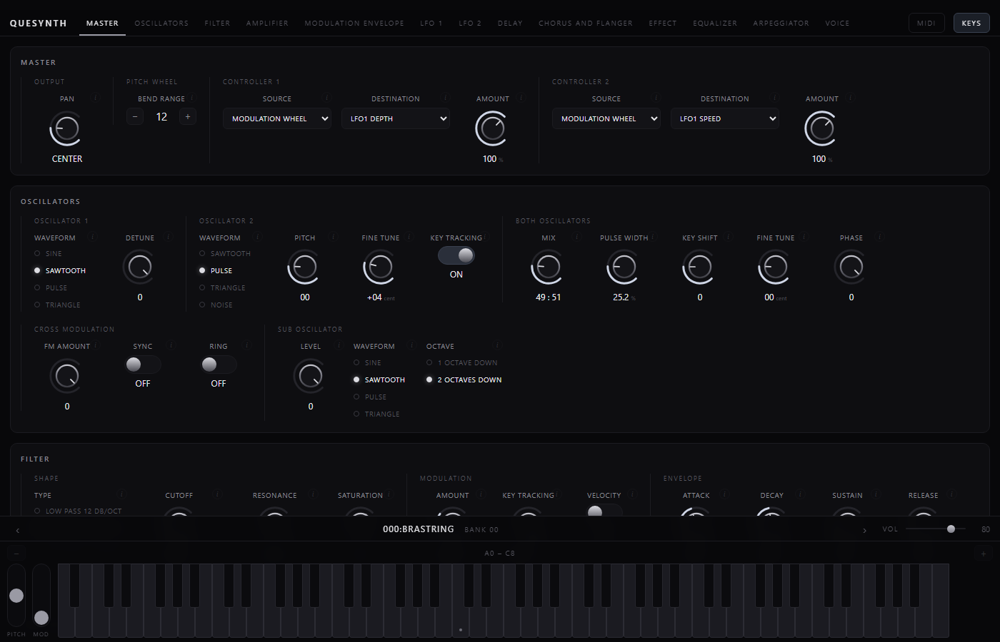

# Quesynth

*keh-SINTH*

A virtual analogue synthesiser written in [Odin](https://odin-lang.org), built to
match [Synth1](https://daichilab.sakura.ne.jp/) closely enough to load its `.sy1`
patches and sound like them — verified by null-testing against the original
plugin rather than by ear.

**[Try it in a browser →](https://mauro-moreno.github.io/quesynth/)**



---

## Please use Synth1 instead

[Synth1](https://daichilab.sakura.ne.jp/) is free, has been refined since 2002,
and has been used on an enormous amount of released music. It is stable, it is
finished, and it is *good*. If you want to make music, download Synth1 and make
music.

**Quesynth is an experiment, not a replacement.** It exists to find out how far a
synthesiser can be reverse-engineered by measurement — feeding signals into the
real plugin, measuring what comes out, and fitting the engine to the results. That
is an interesting question, and answering it produced the tables in `src/engine`
and the write-up in [`docs/null-test.md`](docs/null-test.md). It did not produce a
finished instrument.

Concretely, what that means for you:

- It is **not battle-tested**. Synth1 has two decades of users finding its edges.
  This has me, a null test, and a few weeks.
- It does **not** match the reference everywhere. Several patches are audibly off,
  and the ones that are worst are named in the null-test write-up.
- Anything may change. Parameter behaviour, state format, plugin identity — none
  of it is stable yet.
- There is no support, no release, and no promise that a session saved today opens
  tomorrow.

Use it to read, to measure, to take apart. Do not put it on a deadline.

## What works

An instrument that loads Synth1 patches and plays them, in four hosts, with a
factory bank of its own:

| host | |
|---|---|
| **VST3** | plugin, with the interface below as its editor. Tested in Ableton Live 11 |
| **CLAP** | plugin |
| **standalone** | desktop shell, WASAPI out and winmm MIDI in |
| **WebAssembly** | the same engine in a browser — that is what the demo link is |

One HTML interface serves all four. The panel a browser shows, a phone shows and a
DAW shows are the same files: the plugin embeds them in a WebView2 control, and
`ui/bridge.js` absorbs the difference between hosts so nothing above it knows
which one it is in.



The panel reads in **units rather than in `0..127`**. Synth1's own display shows a
bare number for the cutoff, every envelope segment, the LFO speed and the
resonance; here those read as hertz, milliseconds, Q and octaves, taken from the
measurements in [`docs/null-test.md`](docs/null-test.md). Where the reference
already shows a real unit, its own display string is used unchanged.

> The live demo runs the real engine and ships this project's own factory bank —
> sixteen patches written for it, in `patches/quesynth/factory.json`. Synth1's
> banks are not redistributed here; point `tools/uibank` at your own Synth1
> installation to load those instead.

## How it is checked

The interesting part of this project is not the DSP, it is the method.

`tools/s1probe` is a small VST2 host that loads the real `Synth1 VST64.dll`,
drives it and this engine with identical input, and compares the output —
spectrum, envelope, level, stereo width, and the depth of the null when one is
subtracted from the other. Every measured table in `src/engine` was produced by a
probe in that directory, and every claim in the docs has a number behind it.

That method has a failure mode worth knowing about, because it caught this project
twice: **a test that builds its input with the same code that reads it cannot
fail.** A null test comparing two engines cannot see an error in what the patch
*file* means, because the error is upstream of both. The single largest
improvement here — discovering that all 128 factory patches are stored in a
pre-1.07 format whose parameters mean different things — was invisible to the null
test for exactly that reason.

## Building

Needs [Odin](https://odin-lang.org). Windows for the VST3 and standalone hosts;
the engine itself has no operating system in it.

```
odin test tests/dsp                                                  # the DSP suite
odin build hosts/standalone -o:speed -out:build/quesynth.exe         # desktop
odin build hosts/clap -build-mode:dll -o:speed -out:build/quesynth.clap
pwsh tools/install-vst3.ps1 -Destination "C:\Program Files\Common Files\VST3"
```

The VST3 install script assembles a bundle: the plugin, the WebView2 loader beside
it, and the panel under `Contents/Resources/ui`. The editor needs the [Edge
WebView2 runtime](https://developer.microsoft.com/microsoft-edge/webview2/), which
is already present on current Windows; without it the plugin still loads and plays
and the host draws its own generic parameter panel.

For the browser build:

```
odin build hosts/wasm -target:js_wasm32 -o:speed -out:hosts/wasm/synth.wasm
node hosts/wasm/serve.js                                    # then open :8177
```

## Layout

```
src/dsp/          layer 0, pure DSP — no OS, no allocation on the audio path
src/engine/       layer 1, voices, smoothing, patch binding
src/patch/        .sy1 and .fxb parsing
src/clap/         C ABI bindings: CLAP
src/vst3/         C ABI bindings: VST3
src/webview2/     C ABI bindings: Edge WebView2
ui/               the panel — one interface, naming no host
patches/quesynth/ the factory bank, sixteen patches in this project's JSON
hosts/            CLAP, VST3, standalone, WebAssembly
tools/            s1probe and the measurement tooling the tables came from
docs/             measured ground truth and design notes
```

The layering is driven by wanting a mobile port to be a new adapter rather than a
rewrite, so everything that makes sound sits in a layer with no operating system,
plugin, or allocator dependency. [`docs/architecture.md`](docs/architecture.md)
has the rules.

## What is not included

Synth1's own files are not in this repository and are not this project's to
redistribute: the plugin binary, its factory patch banks, its manual, and the
third-party banks used for testing are all ignored. `tools/s1probe` and
`tools/uibank` read them from your own Synth1 installation.

## Contributing

Welcome, and [`CONTRIBUTING.md`](CONTRIBUTING.md) is worth reading first: this
project is checked by measurement rather than by argument, so a change to
anything audible needs a null-test number behind it. That file also records the
one mistake this project has made twice, which is worth knowing before you write
a test here.

## License

[MIT](LICENSE), covering the work in this repository: the engine, the hosts, the
interface, the tooling, and the measurements in `docs/`.

Nothing of Synth1's is included, so nothing here is relicensed that is not mine
to relicense: not the plugin binary, not the factory patch banks, not the
manual. What this repository records about the reference is measurement and
notes — facts about how it behaves, gathered by `tools/s1probe` — rather than
any part of the thing itself.

## Credits

Synth1 is by **Daichi Kanenaga**. This project measures it, matches it, and is
indebted to it. It is not affiliated with or endorsed by its author.
