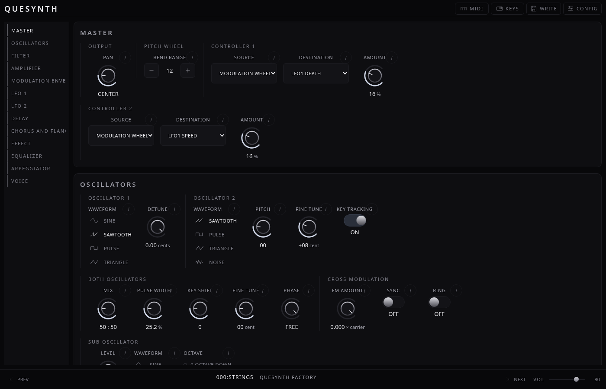

# Quesynth

*Pronounced “keh-synth”.*

Quesynth is a polyphonic virtual-analogue synthesizer written in
[Odin](https://odin-lang.org). It recreates the sound and parameter model of
[Synth1](https://daichilab.sakura.ne.jp/) through direct measurement, supports
Synth1 `.sy1` patches, and runs as a VST3 or CLAP plugin, an Audio Unit, a
standalone instrument, and WebAssembly, across Windows, Linux, and macOS.

**[Open the browser instrument](https://mauro-moreno.github.io/quesynth/)**



## Instrument overview

- Two main oscillators and a sub oscillator, with pulse-width control, frequency
  modulation, ring modulation, and hard sync
- State-variable and four-pole ladder filtering, resonance, key tracking,
  envelope modulation, and saturation
- Amplitude, filter, and modulation envelopes; two tempo-synchronizable LFOs
- Polyphonic and monophonic playing modes, portamento, unison, and arpeggiation
- Parametric equalization, ten effect algorithms, delay, and chorus
- A shared HTML interface for browser, VST3, and CLAP hosts
- Synth1 `.sy1` and bank import, plus Quesynth JSON patch and bank formats

Panel values are presented in musical or engineering units—including hertz,
milliseconds, decibels, Q, semitones, cents, and rhythmic divisions—rather than
only as stored integers.

## Quick start

The browser version requires no installation. Open the live instrument, select a
patch, and play from a MIDI controller, the computer keyboard, or the on-screen
keyboard. Audio begins after the first user interaction, as required by browser
audio policy.

The browser build also includes **Quesynth Pad**: a 16-cell synth rack with one
Quesynth engine per active cell, MIDI note routing, root-note translation,
velocity, gate/one-shot triggers, choke groups, mute/solo, per-cell mix controls,
MIDI Learn, GM/chromatic maps, and portable `.qkit` files. It reuses the same
synth editor rather than maintaining sixteen copies of it.

Prebuilt plugins, the standalone, and the Audio Unit are attached to the
[latest release](https://github.com/mauro-moreno/quesynth/releases); or build the
target you want as described below. The plugin editor is the shared `ui/` panel
hosted in a web view: Edge WebView2 on Windows, WebKitGTK on Linux, and a
WKWebView on macOS (the Audio Unit's Cocoa view). When none is available the
audio engine still loads and the host draws its own generic parameter view.

| Target | Purpose | Platform |
|---|---|---|
| WebAssembly | Browser instrument and live demonstration | Modern browsers |
| VST3 | DAW instrument; panel via WebView2 (Windows) or WebKitGTK (Linux) | Windows, Linux |
| CLAP | DAW instrument; panel via WebView2 (Windows) or WebKitGTK (Linux) | Windows, Linux |
| Audio Unit | DAW instrument; panel via WKWebView (the AU's Cocoa view) | macOS |
| Standalone | WASAPI/WinMM on Windows, ALSA on Linux | Windows, Linux |

## Signal architecture

```text
OSC 1 ─┐
OSC 2 ─┼─ modulation/mix ─ filter ─ amplifier ─ EQ ─ effect ─ delay ─ chorus ─ output
SUB   ─┘                         ▲          ▲
                         filter envelope   amplitude envelope
                                ▲
                         LFO 1 · LFO 2 · modulation envelope
```

Oscillators and filters are evaluated for every active unison layer. Envelopes
and note-level modulation belong to the note voice. The effects chain processes
the mixed stereo output once per sample. The [synthesis theory manual](https://github.com/mauro-moreno/quesynth/wiki/Synthesis-Theory)
explains how these stages shape a sound; [the mathematics](https://github.com/mauro-moreno/quesynth/wiki/Mathematics)
documents their discrete-time models and coefficients.

## User manual

The [Quesynth Wiki](https://github.com/mauro-moreno/quesynth/wiki) is the primary
user manual.

| Topic | Contents |
|---|---|
| [Standalone manual](docs/quesynth-manual.md) | Daemon, TUI, browser, banks and archives, MIDI, configuration, MCP server, troubleshooting, safety |
| [Getting started](https://github.com/mauro-moreno/quesynth/wiki/Getting-Started) | Browser, standalone, and plugin setup |
| [The panel](https://github.com/mauro-moreno/quesynth/wiki/The-Panel) | Control-by-control reference |
| [Banks and patches](https://github.com/mauro-moreno/quesynth/wiki/Banks-And-Patches) | Browsing, writing, importing, and persistence |
| [MIDI control](https://github.com/mauro-moreno/quesynth/wiki/MIDI-Control) | Program changes, bank select, and controller assignments |
| [Synthesis theory](https://github.com/mauro-moreno/quesynth/wiki/Synthesis-Theory) | Oscillators, spectra, filters, envelopes, modulation, and gain staging |
| [Mathematics](https://github.com/mauro-moreno/quesynth/wiki/Mathematics) | Equations used by the audio engine |
| [Patch archetypes](https://github.com/mauro-moreno/quesynth/wiki/Patch-Archetypes) | Practical starting points for sound design |
| [Architecture](https://github.com/mauro-moreno/quesynth/wiki/Architecture) | DSP, engine, host, and interface boundaries |
| [Verification](https://github.com/mauro-moreno/quesynth/wiki/Verification) | Measurement and null-test methodology |

## Building and testing

Install [Odin](https://odin-lang.org), then run commands from the repository root.

```powershell
odin test tests/dsp
odin build hosts/standalone -o:speed -out:build/quesynth.exe
pwsh tools/build-vst3.ps1 -Output build/stage
pwsh tools/build-clap.ps1 -Output build/clap-stage
pwsh tools/install-vst3.ps1 -Destination "C:\Program Files\Common Files\VST3"
```

On Linux the standalone target builds the same way and plays through ALSA
(`libasound.so.2`, loaded at run time), which also reaches a PipeWire server:

```sh
odin build hosts/standalone -o:speed -out:build/quesynth
./build/quesynth                 # play live through ALSA
./build/quesynth patch.sy1       # play a patch
./build/quesynth --selftest patch.sy1 out.wav   # render offline, open no device
```

The Linux VST3 and CLAP plugins assemble the same way, panel and all
(`libwebkit2gtk-4.1` is loaded at run time, so no `-dev` package is needed):

```sh
bash tools/build-vst3.sh build/stage        # Quesynth.vst3 bundle, with ui/
bash tools/build-clap.sh build/clap-stage   # Quesynth.clap + Quesynth-ui/
```

The Audio Unit is macOS only. `tools/build-au.sh` assembles the `.component`,
and CI validates it with `auval` before it ships:

```sh
bash tools/build-au.sh build/au-stage       # Quesynth.component
```

Build and serve the browser target with:

```powershell
odin build hosts/wasm -target:js_wasm32 -o:speed -out:hosts/wasm/synth.wasm
node hosts/wasm/serve.js
```

Then open `http://localhost:8177`. Additional build and platform details are in
the host-specific README files under `hosts/`.

For the native standalone daemon with the same HTML panel, build the standalone
binary and run:

```sh
./build/quesynth --browser
```

This starts or attaches to the daemon, serves the shared `ui/` over a local
WebSocket bridge, and opens the default browser. The page is a peer of the
TUI: both are clients of the same daemon, which owns the sound, the bank and
the current patch, so a change made in either shows in the other. Node.js is
required; set `QUESYNTH_ROOT` when running the binary outside the repository
tree. See [`hosts/standalone/browser`](hosts/standalone/browser/README.md).

The daemon also owns which MIDI input it listens to: the TUI chooses it with
`M`, and the page's MIDI button shows and changes the same selection. A page
served by `--browser` does not use Web MIDI, so a keyboard is never heard
twice. By default every input is open, as it always has been.

A native controller can also select patches: CC 0 and CC 32 hold the bank's
MSB and LSB per MIDI channel, and Program Change loads slot 0–127. Bank 0 is
the daemon's current factory or user bank. A channel that has never sent
Bank Select stays in the bank the sound is playing from instead, so after a
patch is loaded from an archive bank, Program Change picks patch 0–127 of
that bank. Other banks, empty slots and patches past a bank's end leave the
sound unchanged. Both halves start at zero; sending only one keeps the
other's last value, and Program Change does not reset them. Loads use the same
atomic replacement as the TUI and browser, with held notes kept sounding.

## Standalone manual and MCP server

[`docs/quesynth-manual.md`](docs/quesynth-manual.md) is the reference for the
native standalone: build and `--selftest`, the daemon's lifecycle and socket,
the TUI, the browser front-end, ordinary and ZIP banks, patch identity, MIDI
input selection with Bank Select and Program Change, the files Quesynth keeps,
the MCP server, troubleshooting, and safety. `man -l docs/quesynth.1` shows the
[man page](docs/quesynth.1), which lists every mode.

```sh
./build/quesynth                  # attach the TUI, starting the daemon if needed
./build/quesynth --browser        # the same daemon, in a browser at 127.0.0.1:8177
./build/quesynth --mcp            # serve MCP over stdio to a running daemon
./build/quesynth --stop           # stop the daemon
```

`quesynth --mcp` is a local stdio [MCP server](docs/quesynth-manual.md#mcp-server)
built into the same executable. It is a client of the daemon's control socket,
and it offers two tools, `inspect_synth` and `apply_parameters` (an atomic batch
of parameter values, applied only if the daemon's revision is still the one you
name), and two resources, `quesynth://parameters` and `quesynth://patch`. The
project registers it in [`.mcp.json`](.mcp.json) as `quesynth --mcp`, so
`quesynth` has to be on your `PATH`; the manual shows how. Start a daemon
first: until one is running, the calls that need it return
`daemon_unavailable`. The MCP server needs no Node.js. Only `--browser` does,
and it needs Node.js 20 or later.

## Compatibility and verification

Quesynth is a measurement-driven compatibility project, not an official Synth1
release. `tools/s1probe` hosts the reference plugin and Quesynth with identical
events, then compares level, spectrum, envelope contour, stereo behavior, and
sample-aligned null depth. The measured parameter tables live in `src/engine`;
the methodology and known limitations are documented in
[`docs/null-test.md`](docs/null-test.md).

Synth1 binaries, manuals, and patch banks are not redistributed. Import tools
operate on files supplied from the user's own Synth1 installation.

## Repository layout

```text
src/dsp/           allocation-free DSP primitives
src/engine/        voices, smoothing, modulation, and parameter binding
src/patch/         Synth1 and Quesynth patch parsing
src/clap/          CLAP ABI bindings
src/vst3/          VST3 ABI bindings
src/audiounit/     Audio Unit (AUv2) ABI + CoreFoundation bindings
src/webview2/      Edge WebView2 ABI bindings (Windows plugin editor)
src/webkitgtk/     WebKitGTK ABI bindings (Linux plugin editor)
src/webkit/        AppKit + WebKit (WKWebView) bindings (macOS plugin editor)
ui/                shared instrument and pad interface
hosts/             standalone, plugin (VST3, CLAP, Audio Unit), and WebAssembly adapters
patches/quesynth/  Quesynth factory bank
tools/             measurement, conversion, build, and installation utilities
docs/              engineering specifications and verification reports
```

See [`CONTRIBUTING.md`](CONTRIBUTING.md) before submitting audible changes.
Compatibility claims must be supported by reproducible measurements or tests.

## Project status

Quesynth is experimental software. Host integration, session compatibility, and
sound matching continue to evolve, and some reference patches remain measurably
or audibly different. Evaluate the current build before relying on it in a
production session.

## License and attribution

Quesynth is available under the [MIT License](LICENSE). Synth1 was created by
Daichi Kanenaga. Quesynth is an independent project and is not affiliated with or
endorsed by the Synth1 author.
